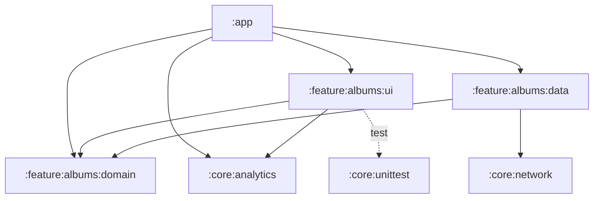

# Architecture

This app displays a list of albums from the Leboncoin endpoint and a detail screen for each album. It follows **Clean Architecture** split across **Gradle modules**, with an **MVVM** presentation layer built in **Jetpack Compose**.

## Module overview

```
:app
:core:analytics
:core:network
:core:unittest
:feature:albums:domain
:feature:albums:data
:feature:albums:ui
```



| Module | Type | Role |
|---|---|---|
| `:app` | Android application | Entry point: `Application` class (Hilt), `MainActivity`, navigation graph, and the DI module binding the repository implementation to its interface. |
| `:feature:albums:domain` | Pure Kotlin (JVM) | Business layer: `Album` model, `AlbumRepository` interface, use cases. No Android dependency. |
| `:feature:albums:data` | Android library | Data layer: Retrofit service, remote data source, DTOs, DTO → domain mappers, repository implementation. |
| `:feature:albums:ui` | Android library | Presentation layer: Compose screens, ViewModels, UI states, domain → UI converters, routes. |
| `:core:network` | Android library | Shared network setup (Retrofit, OkHttp, kotlinx.serialization) provided through Hilt. Base URL defined in `BuildConfig`. |
| `:core:analytics` | Android library | `AnalyticsHelper`, injectable from any feature. |
| `:core:unittest` | Android library | Shared test utilities (`MainDispatcherRule`). |

## Layers

### Domain (`:feature:albums:domain`)

The center of the architecture. It depends on nothing else in the project.

- `model/Album`: the business entity.
- `repository/AlbumRepository`: the contract the data layer must fulfil.
- `usecase/GetAlbumsUseCase` and `usecase/GetAlbumDetailsUseCase`: one use case per action, so ViewModels never talk to the repository directly.

It is a **pure Kotlin JVM module**. This keeps business logic independent of the Android framework, makes it fast to test, and makes it impossible to leak Android types into it by accident. It depends only on `javax.inject` (for `@Inject` constructors), coroutines and kotlin-result.

### Data (`:feature:albums:data`)

Implements the domain contract.

- `api/AlbumApiService`: Retrofit interface.
- `api/AlbumRemoteDataSource`: wraps API calls.
- `api/dto/AlbumDto`: network model, annotated for kotlinx.serialization.
- `api/mapper/AlbumMapper`: converts `AlbumDto` to `Album`, so network models never leave this module.
- `repository/AlbumDataRepository`: implementation of `AlbumRepository`.

### UI (`:feature:albums:ui`)

MVVM with one ViewModel and one UI state per screen.

- `albums/`: list screen (`AlbumsScreen`, `AlbumItem`, `AlbumsViewModel`, `AlbumsUiState`).
- `albumdetails/`: detail screen (`AlbumDetailsScreen`, `AlbumDetailsViewModel`, `AlbumDetailsUiState`).
- `AlbumViewState` and `AlbumConverter`: a UI-specific model and its mapping from the domain model, so screens only receive what they display.
- `navigation/Routes`: type-safe navigation routes (kotlinx.serialization).

The ViewModels expose a UI state that the Compose screens observe with lifecycle awareness (`lifecycle-runtime-compose`). Since state lives in the ViewModel, it survives **configuration changes** such as rotation.

## Data flow

```
Compose Screen ──▶ ViewModel ──▶ UseCase ──▶ AlbumRepository (interface)
                                                    ▲
                                                    │ implemented by
                                          AlbumDataRepository ──▶ RemoteDataSource ──▶ Retrofit
```

Data goes back the other way through the mappers: `AlbumDto` → `Album` → `AlbumViewState`. Each layer has its own model.

## Dependency injection

**Hilt** (built on Dagger) is used throughout.

- `PhotoApp` is the `@HiltAndroidApp` entry point.
- `core:network/di/NetworkModule` provides Retrofit and OkHttp.
- `app/di/RepositoryModule` binds `AlbumDataRepository` to `AlbumRepository`. Keeping this binding in `:app` means `:feature:albums:ui` only knows the domain, never the data module.
- ViewModels are obtained in Compose with `hilt-navigation-compose`.

Hilt was chosen because it is the standard DI solution on Android, gives compile-time safety, and removes the boilerplate of manual Dagger components. KSP is used instead of kapt for faster builds.

## Error handling

Errors are modelled with **kotlin-result** (`Result<V, E>`) instead of exceptions. Use cases and the repository return explicit results, which forces each caller to handle the failure case and makes error paths easy to test.

## Libraries

| Concern | Library | Why |
|---|---|---|
| UI | Jetpack Compose, Material 3 | Modern declarative UI toolkit. |
| Design system | Spark (Adevinta) | Leboncoin's own design system. |
| Navigation | Navigation Compose (type-safe routes) | Official solution, compile-time-checked arguments. |
| DI | Hilt + KSP | See above. |
| Network | Retrofit + OkHttp | De facto standard, logging interceptor for debugging. |
| Serialization | kotlinx.serialization | Kotlin-native, no reflection, also used for navigation routes. |
| Async | Kotlin Coroutines | Structured concurrency, integrated with ViewModel and Compose. |
| Images | Coil 3 | Kotlin-first and Compose-native, with OkHttp networking. |
| Errors | kotlin-result | Explicit, typed error handling. |
| Memory leaks | LeakCanary (debug only) | Detects leaks during development. |

## Testing

Unit tests sit next to the code in each layer:

| Layer | Tests |
|---|---|
| Domain | `GetAlbumsUseCaseTest`, `GetAlbumDetailsUseCaseTest` |
| Data | `AlbumMapperTest`, `AlbumDataRepositoryTest` |
| UI | `AlbumConverterTest`, `AlbumsViewModelTest`, `AlbumDetailsViewModelTest` |

Tooling: JUnit 4, Mockito-Kotlin for mocks, `kotlinx-coroutines-test` for coroutines, Robolectric for tests needing Android resources, and `MainDispatcherRule` (shared from `:core:unittest`) to replace `Dispatchers.Main` in ViewModel tests.

## Adding a new feature

Create `:feature:<name>:domain`, `:data` and `:ui` following the same structure, bind the repository in `:app`, and register the screens in `AppNavHost`. Shared concerns go into a `:core:*` module.